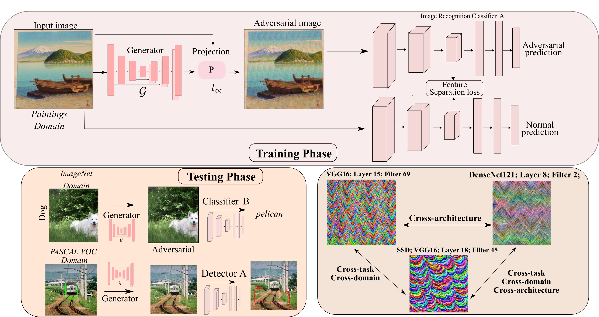

## Introduction

This is an official release of the paper **Learning Transferable Adversarial Perturbations**.


**Abstract.** While effective, deep neural networks (DNNs) are vulnerable to adversarial attacks.
In particular, recent work has shown that such attacks could be generated
by another deep network, leading to significant speedups over optimization-based
perturbations. However, the ability of such generative methods to generalize to
different test-time situations has not been systematically studied. In this paper,
we therefore investigate the transferability of generated perturbations when the
conditions at inference time differ from the training ones in terms of target architecture,
target data, and target task. Specifically, we identify the mid-level features
extracted by the intermediate layers of DNNs as common ground across different
architectures, datasets, and tasks. This lets us introduce a loss function based on
such mid-level features to learn an effective, transferable perturbation generator.
Our experiments demonstrate that our approach outperforms the state-of-the-art
universal and transferable attack strategies.


## Installation

1. It is tested with the following packages and hardware:

    ``` text
      PyTorch: 1.7.1+cu101
      Python: 3.6.9
      Torchvision: 0.8.2+cu101
      CUDA: 10.1
      CUDNN: 7603
      NumPy: 1.18.1
      PIL: 7.0.0
      GPU: Tesla V100-SXM2-32GB
   ```

2. Download source code from GitHub
   ```
    git clone https://github.com/krishnakanthnakka/Transferable_Perturbations.git
   ```
3. Create [conda](https://docs.conda.io/en/latest/miniconda.html) virtual-environment
   ```
    conda create --name LTP python=3.6.9
   ```
4. Activate conda environment
   ```
    source activate LTP
   ```
5. Install requirements and set the paths
   ```
    pip install -r requirements.txt
    source envs.sh
    ```
6. We release  ```pretrained generator checkpoints``` (for white-box and standard black-box setting as in Table 1) on [GoogleDrive](https://drive.google.com/drive/folders/1QkJh9EPGyq_LnzzU5mzpkBNhJFxIxGMu?usp=sharing). Please place them in the root folder.


### Data preparation

1. The data structure of ```ImageNet```  or any other dataset looks like below. Please modify the dataloader at ```cda/data/datasets/image.py``` accordingly for your dataset structure

    ```text
    /datasets/
    ├── imagenet
    │   ├── train
    │   │   ├── n02328150
    │   │   ├── n03447447
    │   ├── val
    │   │   ├── n02328150
    │   │   ├── n03447447
    |-- comics
    |   |-- train
    |   |   |── All-Star Section Eight
    |   |   |── Action Comics v2

    ```
2. We evaluate on 5K random samples from ImageNet val-set. We release the 5K samples in text file at ```cda/data/datasets/imagenet5k_val.txt```.


### Training Generators

1. For example, we use following command to train generator against ```squeezenet``` classfier pretrained on ```imagenet``` using feature separation loss. You can change the ```act_layer``` argument in the bash script to attack other layers.
   ```bash
   bash scripts/imagenet/squeezenet.sh
   ```
2. To train generator against another datasets, prepare the config file at ```cda/config/``` and put the images path & label text file at ```cda/data/datasets/```

3. To train generator against extreme cross-domain attack, we used the public chestxNet implementation available [here](https://github.com/zoogzog/chexnet)


## Testing on Cross-Model Setting

1. Set all environmental paths and other packages in path by ```source envs.sh```

2. For attacking PyTorch Image recognition models using the generator trained on ```squeezenet``` discriminator and ```imagenet``` dataset:
   ```bash
   bash run_exps.sh  squeezenet1_1 imagenet feat

   # Similarily to attack with other generators
   bash run_exps.sh  vgg16 imagenet feat
   bash run_exps.sh  densenet121 imagenet feat
   bash run_exps.sh  resnet152 imagenet feat
   bash run_exps.sh  inception imagenet feat
   ```


### Results on ImageNet models

1. We observe the fooling rate metric values (percentage of images for which label is flipped) on ImageNet5K val-set as in Table 1.
    | Train  | VGG16 | ResNet152 | Inceptionv3 | DenseNet121 | SqueezeNet1.1 | ShuffleNet  | MNASNet  |    MobileNet |
    | :---:  | :---: | :---:     | :---:       | :---:       | :---:      | :---:       |  :---:   |       :---:  |
    |  VGG16| 99.32% |68.38%    | 46.60%        |84.68%      | 86.52%     | 67.84%      | 90.44%   |   60.08%     |
    |SqueezeNet1.1|  96.06%|   76.44%|   70.66% |   88.70%  |  99.68% |   90.06%        | 90.06%    |   84.58%|


## Testing on Cross-Task Setting on SSD

1. To run SSD experiments, first enter the  ```SSD``` folder and set paths to SSD library
   ```bash
   cd SSD
   source envs.sh
   ```
2. Download and place the trained SSD models from [GoogleDrive](https://drive.google.com/drive/folders/13TLIHLjDh4IeSiA5vXIqnLpCOwNdzxI9?usp=sharing) and place in this SSD folder.
   We used publicly available [SSD](https://github.com/lufficc/SSD) implementation to train models for a maximum of 120K iterations. Please refer to that codebase to train more backbones and frameworks.

3. Prepare the VOC dataset in ```datasets/2007``` and ```datasets/2012```

    ```text
        /SSD/datasets/
        ├── VOC2007
        │   ├── JPEGImages
        │   ├── ImageSets
        │   ├── Annotations
        │   ├── .....
        ├── VOC2012
        │   ├── JPEGImages
        │   ├── ImageSets
        │   ├── Annotations
        │   ├── .....

4. For attacking SSD models using the generator trained on ```squeezenet``` discriminator and ```imagenet``` dataset:
   ```bash
   bash run_exps.sh  squeezenet1_1 imagenet feat

    # Similarily to attack with other generators
   bash run_exps.sh  vgg16 imagenet feat
   bash run_exps.sh  densenet121 imagenet feat
   bash run_exps.sh  resnet152 imagenet feat
   bash run_exps.sh  inception imagenet feat
   ```

### Results on SSD detectors

1. We report mAP on PASCAL VOC test set before and after attack with generator trained against  discriminators (pretrained on ImageNet) and ImageNet data.

    | Train  | VGG16 | ResNet50 | EfficientNet | MobileNet |
    | :---:  | :---: | :---:     | :---:       | :---:     |
    |Clean|  68.1|   66.1|   61.1|   55.4 |
    |VGG16|  8.30|   11.8|   11.4 |   9.12 |
    |SqueezeNet1.1|  13.1|   10.8|   11.5 |   6.19 |


## Citation

```bibtex
@inproceedings{nakka2021learning,
    title={Learning Transferable Adversarial Perturbations},
    author={Krishna Kanth Nakka and Mathieu Salzmann},
    year={2021},
    booktitle={NeurIPS},
}
```


## Acknowledgements

This codebase is borrowed from multiple sources. We thank owner of [SSD](https://github.com/lufficc/SSD) for building a highly-modular pipeline. We also thank the authors of [CSA](https://github.com/MasterBin-IIAU/CSA) and [CDA](https://github.com/Muzammal-Naseer/Cross-Domain-Perturbations/) for releasing their codebase.
